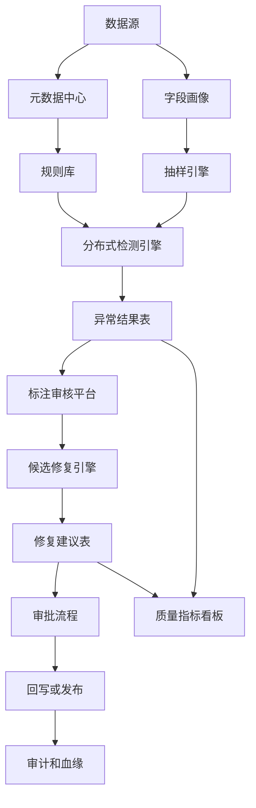
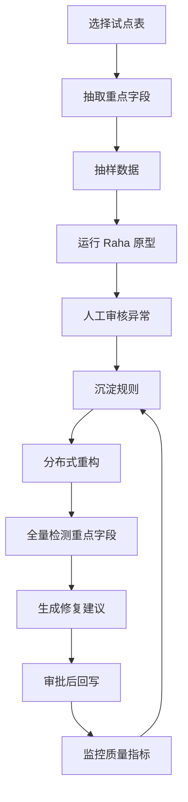

# Raha 项目用于数据治理异常发现与错误纠正的适配性分析

## 1. 结论摘要

针对现场“上百张表、每张表平均约 100 个字段、每张表千万级数据量”的数据治理场景，当前 Raha 项目不适合直接作为生产级全量异常发现和错误纠正引擎使用。

更准确的定位是：

- 可以作为数据异常发现和错误纠正的算法原型、研究验证工具、抽样质检工具、标注辅助工具。
- 可以复用其“多策略候选发现 + 少量标注 + 半监督集成”的思想。
- 可以复用部分检测策略、修复候选生成思想和评估指标体系。
- 不能直接承载百表、宽表、千万级全量生产数据治理任务。
- 若要用于企业级数据治理，需要重构为分布式、分层、可采样、可增量、可审计、可配置的质量规则与模型平台。

推荐判断：

| 维度 | 当前项目直接可用性 | 说明 |
| --- | --- | --- |
| 小数据集离线实验 | 高 | 项目原本就是为研究实验和论文复现设计 |
| 单表抽样异常发现 | 中 | 可用于抽样数据、探索规则、辅助标注 |
| 单表全量千万级检测 | 低 | 当前 Pandas 和层次聚类无法稳定承载 |
| 百表批量治理 | 低 | 缺少任务编排、元数据管理、资源隔离和分布式执行 |
| 自动错误纠正上线 | 低 | 自动纠正存在业务风险，需要审批、回滚和审计 |
| 算法思想复用 | 高 | 多策略集成和主动学习思想有较强参考价值 |

## 2. 目标场景规模拆解

现场规模假设如下：

| 指标 | 规模 |
| --- | --- |
| 表数量 | 100 张以上 |
| 平均字段数 | 100 个左右 |
| 单表数据量 | 1000 万行级别 |
| 单表单元格数量 | 约 10 亿个单元格 |
| 全库单元格数量 | 约 1000 亿个单元格 |

这个规模已经不是普通单机数据清洗任务，而是典型的大规模数据质量治理任务。核心难点不只是算法准确率，还包括：

- 数据读取和计算资源。
- 表级和字段级元数据管理。
- 全量扫描成本。
- 批量任务调度。
- 误报和漏报治理。
- 自动纠正的业务风险。
- 结果审计、回滚和血缘追踪。
- 多租户、多任务、多规则的资源隔离。

## 3. 当前项目计算模型分析

### 3.1 数据读取方式

`Dataset.read_csv_dataset` 使用 `pandas.read_csv` 一次性读取 CSV：

```python
dataframe = pandas.read_csv(..., dtype=str, keep_default_na=False, low_memory=False)
```

这意味着：

- 数据必须先落为 CSV 文件。
- 数据被一次性加载到单机内存。
- 所有字段都按字符串读取。
- 没有分区读取、谓词下推、列裁剪、流式处理。
- 没有直接连接 Hive、Spark、Flink、数据库、湖仓或消息队列的能力。

对于 1000 万行、100 字段的表，单表约 10 亿个字符串单元格。即使平均每个值只有 10 到 20 字符，Pandas 对象字符串的内存开销也会远大于原始数据体积，单表可能需要几十 GB 到上百 GB 内存，生产环境不可控。

### 3.2 检测策略枚举规模

`Detection.run_strategies` 默认启用：

- `OD`
- `PVD`
- `RVD`
- `KBVD`

其中策略数量随字段数快速增长。

#### 3.2.1 OD 策略

OD 使用 dBoost。默认配置包括：

- 25 个 histogram 参数组合。
- 9 个 gaussian 参数组合。
- 合计 34 个基础配置。

这些策略需要对数据进行统计离群检测。宽表和千万行下，每次策略扫描都很重。

#### 3.2.2 PVD 策略

PVD 会按字段枚举字段中出现过的字符：

```python
for attribute in d.dataframe.columns:
    column_data = "".join(d.dataframe[attribute].tolist())
    characters_dictionary = {ch: 1 for ch in column_data}
```

风险：

- 对千万行字段先拼接为一个巨大字符串。
- 字符枚举依赖全量列值。
- 宽表下会对 100 个字段逐列处理。

#### 3.2.3 RVD 策略

RVD 会枚举字段两两组合：

```python
configuration_list = [[a, b] for (a, b) in itertools.product(al, al) if a != b]
```

如果字段数为 100，则 RVD 配置数为：

```text
100 * 99 = 9900
```

每个配置都要扫描全表构建值关系。对千万行宽表来说，这个成本极高。

#### 3.2.4 KBVD 策略

KBVD 会枚举 KATARA 知识库文件。知识库驱动策略本身需要对列和列对做匹配，字段多、数据多时成本也很高。

### 3.3 特征矩阵规模

`Detection.generate_features` 会为每列构建形如：

```text
行数 * 策略数
```

的特征矩阵。

对千万行数据，如果策略画像数量达到几千甚至上万，单列特征矩阵已经不可接受。100 列重复构建后，内存和计算成本会进一步放大。

### 3.4 层次聚类瓶颈

`Detection.build_clusters` 使用：

```python
scipy.cluster.hierarchy.linkage(feature_vectors, method="average", metric="cosine")
```

层次聚类通常需要接近平方级的距离计算和内存占用。对单列 1000 万行做层次聚类不可行。

这是当前项目在千万级数据量下最关键的不可扩展点之一。

### 3.5 修复流程瓶颈

`Correction.initialize_models` 会遍历全量 DataFrame：

```python
for row in d.dataframe.itertuples():
```

并为每个非错误单元格更新邻域模型和域模型。对于 1000 万行、100 字段，即单表 10 亿单元格级别，该步骤很难在单机内稳定完成。

`Correction.predict_corrections` 还会针对已检测错误生成候选修复值和候选特征。如果检测结果较多，候选数量可能迅速膨胀。

### 3.6 结果持久化方式

检测和修复结果使用 `pickle.dump` 保存整个 `Dataset` 对象：

```python
pickle.dump(d, open(..., "wb"))
```

风险：

- 全量 DataFrame 会随对象一起持久化。
- 大表下序列化结果极大。
- 不利于跨语言、跨系统、审计和长期归档。
- 不适合数据治理平台的结果查询和追踪。

## 4. 当前项目适合做什么

### 4.1 适合做算法验证

可以用抽样数据验证：

- 哪类字段容易出现异常。
- 哪些基础策略对某类数据有效。
- 少量标注对检测准确率的提升程度。
- 修复候选模型在某些字段上的效果。

### 4.2 适合做数据质量探索

可以用于：

- 对小样本数据做异常探索。
- 帮助数据治理人员发现潜在规则。
- 为后续规则配置提供候选依据。
- 给数据质量平台生成初始规则建议。

### 4.3 适合做人工标注辅助

Raha 的主动学习思路可以帮助选择更有信息量的样本行，减少人工标注成本。

在治理场景中，可将其改造成：

- 抽样标注推荐。
- 异常样本聚类。
- 数据质量工单辅助。
- 字段质量规则发现助手。

### 4.4 适合做离线抽样质检

如果只对每张表抽取几千到几十万行，并限制字段数和策略数，当前项目可以作为离线质检工具使用。

示例场景：

- 新表入湖前抽样检查。
- 数据迁移后抽样验收。
- 重点字段异常探索。
- 规则上线前效果验证。

## 5. 当前项目不适合直接做什么

### 5.1 不适合直接全量扫描千万级宽表

主要原因：

- 单机 Pandas 全量读入。
- 策略枚举规模大。
- RVD 字段两两组合爆炸。
- 特征矩阵巨大。
- 层次聚类不适合千万行。
- 结果序列化不适合大表。

### 5.2 不适合直接作为生产数据质量平台

生产数据治理通常需要：

- 数据源接入。
- 元数据管理。
- 规则管理。
- 调度编排。
- 分布式执行。
- 指标监控。
- 异常工单。
- 审批流程。
- 修复回写。
- 变更审计。
- 权限控制。
- 质量报表。

当前项目没有这些工程能力。

### 5.3 不适合直接自动纠正业务数据

错误纠正比异常发现风险更高。对于生产业务数据，自动纠正需要非常谨慎。

典型风险：

- 错误值被误判为正确修复值。
- 同名字段在不同业务表中含义不同。
- 字段间依赖无法覆盖业务上下文。
- 自动回写可能破坏原始数据证据。
- 缺少审批和回滚会造成治理事故。

因此，Baran 更适合作为候选修复建议引擎，而不是直接回写生产表的自动修复引擎。

## 6. 在目标场景中的可用性分层

### 6.1 第一层：直接使用当前项目

适用范围：

- 单表小样本。
- CSV 文件。
- 离线实验。
- 有 `clean.csv` 可评估。

不适用范围：

- 百表批量。
- 千万级全量。
- 生产自动纠错。

结论：只能用于原型验证，不建议直接上线。

### 6.2 第二层：抽样质检模式

做法：

- 每张表按分区、时间、主键或业务维度抽样。
- 每张表选择重点字段，不处理所有 100 个字段。
- 限制检测策略集合。
- 将结果作为规则发现和人工审核依据。

可行性：中等。

价值：

- 可以较快发现明显异常模式。
- 可以辅助配置正式质量规则。
- 可以降低人工检查成本。

局限：

- 无法保证发现低频异常。
- 抽样结果不能直接代表全量。
- 对复杂跨表一致性问题支持不足。

### 6.3 第三层：分布式重构模式

做法：

- 用 Spark、Dask 或湖仓计算引擎替换 Pandas。
- 将策略执行拆成分布式任务。
- 将全量层次聚类替换为可扩展采样聚类或近似聚类。
- 将结果写入数据库或湖仓结果表。
- 增加任务调度、元数据、规则配置和审计。

可行性：高，但需要重构。

价值：

- 可以承载大规模数据治理。
- 可以把 Raha 思想转化为平台能力。

局限：

- 改造工作量较大。
- 需要重新验证算法效果。
- 需要补齐工程平台能力。

## 7. 推荐落地架构



说明：

- Raha 类算法应放在“抽样引擎、分布式检测引擎、标注审核平台、候选修复引擎”中，而不是单独承担完整治理平台。
- 异常发现结果和修复建议必须结构化入库，便于查询、追踪、统计和复核。
- 修复动作应通过审批流程，不建议直接自动回写核心业务表。

## 8. 推荐技术改造方向

### 8.1 数据接入改造

当前：CSV + Pandas。

建议：

- 对接 Hive、Iceberg、Hudi、Delta Lake、关系型数据库和数据仓库。
- 支持按分区、字段、时间范围读取。
- 支持列裁剪和谓词下推。
- 支持增量数据处理。

### 8.2 计算引擎改造

当前：单机多进程。

建议：

- 大规模全量检测使用 Spark 或 Flink。
- 算法探索可考虑 Dask 版本或自研 Dask 改造。
- 将策略执行拆成可独立调度的任务。
- 对不同表和不同字段并行处理。

README 中也提到过更快版本 `DaskRaha and DaskBaran`，说明原作者也意识到单机版本存在性能瓶颈。该方向可以作为参考，但仍需要结合现场数据治理平台重新验证。

### 8.3 策略生成改造

当前：默认枚举大量策略。

建议：

- 基于字段类型筛选策略。
- 基于元数据限制字段组合。
- RVD 不应对所有字段两两组合，应只对候选关联字段执行。
- KBVD 应只对可映射知识域的字段执行。
- PVD 应基于字段类型和字符画像生成有限策略。

例如 100 个字段不应生成 9900 个 RVD 配置，而应先通过元数据、字段名、主外键、码表和统计相关性筛选出几十个候选组合。

### 8.4 聚类和采样改造

当前：全量层次聚类。

建议：

- 使用分层抽样。
- 使用近似聚类。
- 使用 MinHash、局部敏感哈希或向量索引。
- 按字段类型分别建模。
- 对超大表只聚类样本，不聚类全量。
- 全量预测阶段使用训练后的轻量模型。

### 8.5 纠错流程改造

当前：检测结果进入 Baran 后，候选修复由值级、邻域和域模型生成。

建议：

- 将纠错输出定位为“修复建议”，而非默认自动修复。
- 为每条建议输出置信度、来源策略、命中规则、上下文字段。
- 支持人工确认、批量审批、灰度回写和回滚。
- 对核心字段设置更高阈值。
- 对金额、状态、主键、外键等敏感字段默认只提示不回写。

### 8.6 结果存储改造

当前：pickle 文件。

建议异常结果表结构：

| 字段 | 说明 |
| --- | --- |
| `task_id` | 任务编号 |
| `table_name` | 表名 |
| `partition_value` | 分区 |
| `row_key` | 行主键或定位信息 |
| `column_name` | 字段名 |
| `old_value` | 原始值 |
| `issue_type` | 异常类型 |
| `strategy_name` | 命中策略 |
| `confidence` | 置信度 |
| `suggested_value` | 建议修复值 |
| `status` | 待审核、已确认、已忽略、已修复 |
| `created_at` | 创建时间 |

### 8.7 评估体系改造

当前主要依赖有 `clean.csv` 的实验评估。

生产治理建议增加：

- 抽检准确率。
- 误报率。
- 漏报估计。
- 字段覆盖率。
- 表覆盖率。
- 规则命中趋势。
- 修复采纳率。
- 修复回滚率。
- 工单处理时长。
- 数据质量评分。

## 9. 推荐分阶段落地路线

### 阶段一：离线评估

目标：

- 判断算法思想是否适合现场数据。

做法：

- 选 3 到 5 张典型表。
- 每张表抽样 1 万到 10 万行。
- 选择 10 到 20 个关键字段。
- 跑 Raha 检测。
- 组织人工标注。
- 统计误报和漏报。

产出：

- 异常类型清单。
- 字段规则建议。
- 策略有效性报告。
- 是否继续改造的决策依据。

### 阶段二：规则发现助手

目标：

- 把项目能力用于辅助治理人员配置规则。

做法：

- 固化抽样流程。
- 将检测结果入库。
- 增加异常样本审核页面。
- 人工确认后沉淀为正式规则。

产出：

- 字段画像。
- 规则候选。
- 标注样本库。
- 异常案例库。

### 阶段三：分布式检测引擎

目标：

- 支持重点表和重点字段的准生产检测。

做法：

- 重构数据读取和策略执行。
- 对接调度系统。
- 支持分区级任务。
- 支持策略白名单和黑名单。
- 建立检测结果表和质量看板。

产出：

- 可调度的异常发现任务。
- 可查询的异常结果。
- 表级和字段级质量指标。

### 阶段四：受控纠错建议

目标：

- 提供修复建议，但不直接无审核回写。

做法：

- 对特定字段启用候选修复。
- 输出置信度和解释信息。
- 接入审批流程。
- 建立回滚机制。

产出：

- 修复建议表。
- 审批记录。
- 修复采纳率。
- 回滚记录。

### 阶段五：闭环治理平台

目标：

- 形成发现、确认、修复、沉淀规则、持续监控的闭环。

做法：

- 异常发现与质量规则统一管理。
- 人工标注反哺模型。
- 修复记录反哺规则库。
- 质量指标进入数据资产评价。

产出：

- 数据质量治理闭环。
- 可审计的数据修复流程。
- 持续优化的规则和模型体系。

## 10. 针对目标规模的粗略资源判断

### 10.1 单表单元格规模

```text
1000 万行 * 100 字段 = 10 亿单元格
```

当前项目的核心操作大量以单元格为单位处理，单表就已经达到十亿级单元格。

### 10.2 RVD 策略规模

```text
100 字段 * 99 字段 = 9900 个字段对策略
```

如果每个字段对都扫描千万行，则单表 RVD 相关扫描规模极高。

### 10.3 层次聚类规模

对千万行做层次聚类近似不可行，因为距离矩阵和聚类过程会接近平方级增长。即使只对一列处理，也很难在普通生产单机上完成。

### 10.4 百表并发规模

如果 100 张表都按全量运行，则逻辑单元格规模约为：

```text
100 张表 * 10 亿单元格 = 1000 亿单元格
```

这必须依赖分布式计算、分区执行、策略裁剪和结果分层存储。

## 11. 是否适合数据治理的最终判断

### 11.1 适合的部分

适合复用：

- 多策略异常候选发现思想。
- 半监督学习整合多个检测器的思想。
- 主动学习采样思想。
- 候选修复生成思想。
- 检测和修复评估指标。
- Notebook 原型交互方式。

### 11.2 不适合的部分

不适合直接复用：

- Pandas 全量读取。
- 全量策略枚举。
- 全量层次聚类。
- pickle 保存全量对象。
- 对所有字段自动做 RVD 两两组合。
- 对生产数据直接自动纠正。
- 缺少任务平台和治理流程。

### 11.3 推荐使用方式

推荐定位为：

```text
数据治理算法原型和规则发现辅助工具
```

不推荐定位为：

```text
百表千万级生产数据质量治理引擎
```

## 12. 实施建议清单

如果现场确实希望基于该项目建设能力，建议按以下原则推进：

1. 不做全库全字段全量直接运行。
2. 先做抽样验证和重点字段验证。
3. 将检测策略改成按字段类型和元数据选择。
4. 将 RVD 限制在有业务关联的字段对。
5. 将层次聚类替换为可扩展采样或近似聚类。
6. 将 Pandas 数据层替换为 Spark、Dask 或湖仓执行层。
7. 将 pickle 结果替换为结构化结果表。
8. 将修复能力定位为建议，经过审批后再回写。
9. 建立标注样本库，用人工确认结果反哺模型。
10. 建立质量指标看板，持续观察误报、采纳和回滚情况。

## 13. 推荐试点方案

建议选择一个低风险但有代表性的试点：

| 项目 | 建议 |
| --- | --- |
| 表数量 | 3 到 5 张 |
| 字段数量 | 每张表选择 10 到 20 个关键字段 |
| 数据量 | 每张表抽样 1 万到 10 万行 |
| 数据类型 | 码值、日期、枚举、地址、机构、金额等容易定义质量规则的字段 |
| 目标 | 验证异常发现准确率和规则发现价值 |
| 输出 | 异常样本、规则建议、修复建议、误报分析 |

试点成功后，再考虑分布式化和平台化，而不是直接扩大到所有表。

## 14. 推荐现场落地流程



## 15. 一句话结论

该项目的算法思想适合数据治理中的异常发现和错误纠正方向，但当前代码实现不适合直接用于上百张表、百字段、千万级数据量的生产环境。最佳路线是先作为抽样验证和规则发现工具使用，再将核心思想迁移到分布式数据质量平台，并将错误纠正控制为可审核、可回滚、可追踪的修复建议流程。
