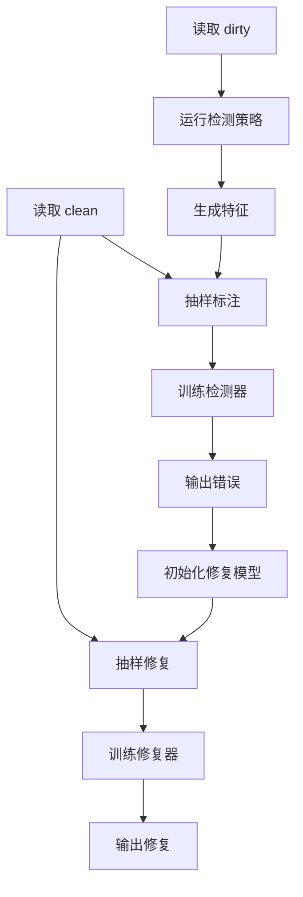
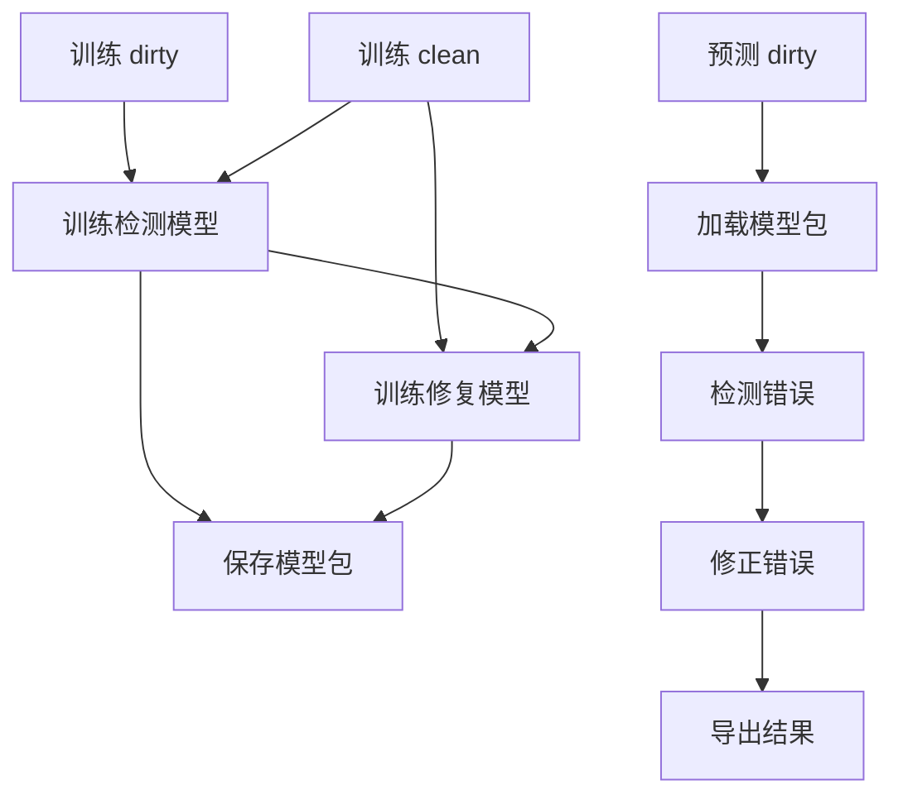

# 训练预测拆分改造影响分析

## 目标

本文分析将当前 Raha/Baran 数据清洗流程拆成训练阶段和预测阶段需要涉及的文件、改动点、工作量和风险。

目标形态如下：

- 训练阶段：输入 `dirty.csv` 和 `clean.csv`，训练并保存错误检测模型、错误修正模型和特征配置。
- 预测阶段：只输入新的 `dirty.csv`，加载已训练模型，输出错误单元格和修复后的 `repaired.csv`。
- 评估阶段：可选输入 `clean.csv`，只用于计算准确率、召回率和修复质量，不参与预测。

## 当前流程概览



当前代码偏实验和交互式清洗。训练、标注、预测和评估混在 `Detection.run()` 与 `Correction.run()` 中，尚未形成可直接部署的模型产物。

## 目标流程



预测阶段不再读取 `clean.csv`，也不再做人工标注、自动标注、模型训练和 benchmark 评估。

## 涉及文件总览

| 文件 | 改动类型 | 改动量 | 说明 |
|---|---|---:|---|
| `raha/dataset.py` | 修改 | 小 | 补充数据集模式、形状校验、无 `clean_path` 默认状态 |
| `raha/detection.py` | 修改 | 中 | 拆分检测训练、检测预测、模型保存和加载 |
| `raha/correction.py` | 修改 | 中到大 | 拆分修复训练、修复预测、候选模型和排序模型保存 |
| `raha/utilities.py` | 修改 | 小到中 | 复用策略筛选、模型路径和评估工具 |
| `scripts/train_cleaning_models.py` | 新增 | 中 | 训练入口脚本 |
| `scripts/predict_cleaning.py` | 新增 | 中 | 预测入口脚本 |
| `scripts/evaluate_cleaning_model.py` | 新增或改造 | 小到中 | 独立评估入口 |
| `scripts/evaluate_mail_resource_cleaning.py` | 修改 | 小 | 接入新训练和预测流程 |
| `models/` 或 `datasets/<name>/models/` | 新增目录 | 小 | 保存模型产物 |
| `doc/` | 新增文档 | 小 | 记录使用方式、模型包格式和限制 |

## `raha/dataset.py` 改动分析

### 现状

`Dataset` 主要负责读取 CSV，并在存在 `clean_path` 时构造 `clean_dataframe`。真实错误通过 `get_actual_errors_dictionary()` 逐格比较 `dirty.csv` 和 `clean.csv` 得到。

当前问题：

- 未提供 `clean_path` 时，`has_ground_truth` 没有显式默认值。
- 训练、预测、评估三种场景没有明确模式区分。
- 形状不一致时只输出告警，后续仍可能继续比较并造成错误。

### 建议改动

- 增加默认属性：
  - `has_ground_truth = False`
  - `has_been_repaired = False`
- 增加数据集模式：
  - `mode = "train"`
  - `mode = "predict"`
  - `mode = "evaluate"`
- 增加结构校验方法：
  - `validate_ground_truth_shape()`
  - `validate_schema(expected_columns)`
- 训练和评估场景要求 `clean.csv` 与 `dirty.csv` 行列完全一致。
- 预测场景只要求新数据字段与模型包中的字段一致。

### 工作量

小。预计 0.5 天以内。

## `raha/detection.py` 改动分析

### 现状

检测流程集中在 `Detection.run()`：

1. 初始化数据集。
2. 运行错误检测策略。
3. 生成单元格特征。
4. 聚类抽样。
5. 使用 `clean.csv` 自动标注或等待交互标注。
6. 标签传播。
7. 在 `predict_labels()` 中按列训练分类器。
8. 立刻预测全表错误单元格。

核心问题是 `predict_labels()` 同时做训练和预测。每一列都会现场构造 `x_train`、`y_train`，训练分类器，然后马上预测 `x_test`。

### 建议拆分

新增或改造以下方法：

| 方法 | 类型 | 说明 |
|---|---|---|
| `train_detection_model(d)` | 新增 | 使用训练集特征和真实标签训练每列检测模型 |
| `predict_detection(d, model_bundle)` | 新增 | 加载模型，对新数据做错误检测 |
| `save_detection_model(model_bundle, path)` | 新增 | 保存检测模型包 |
| `load_detection_model(path)` | 新增 | 加载检测模型包 |
| `build_classifier()` | 新增 | 统一分类器创建逻辑，避免训练和预测重复分支 |
| `generate_features_for_inference(d, feature_spec)` | 新增 | 按模型包中的特征规格生成预测特征 |

### 检测模型包建议字段

```json
{
  "model_type": "raha_detection",
  "version": "1.0",
  "columns": ["字段一", "字段二"],
  "selected_strategies": [],
  "feature_spec": {},
  "column_models": {},
  "column_fallbacks": {},
  "thresholds": {},
  "created_at": "2026-07-09 20:45:00"
}
```

其中：

- `columns` 用于预测时校验字段顺序。
- `selected_strategies` 用于预测阶段只运行必要策略。
- `feature_spec` 固化特征顺序，避免训练和预测特征错位。
- `column_models` 保存每一列的分类器。
- `column_fallbacks` 处理训练集中全正例、全负例或无有效特征的列。

### 策略执行优化

当前 `run_strategies()` 会运行 `OD`、`PVD`、`RVD`、`KBVD` 等策略，且可能产生较多外部调用和文件缓存。

拆分后建议：

- 训练阶段允许运行全量策略。
- 训练阶段记录每个策略的贡献。
- 预测阶段只运行被选中的策略。
- 对高耗时策略增加开关和超时保护。

### 工作量

中等。预计 2 到 3 天可完成可用版。

## `raha/correction.py` 改动分析

### 现状

修复流程集中在 `Correction.run()`：

1. 接收 `detected_cells`。
2. 初始化 `value_models`、`vicinity_models`、`domain_models`。
3. 抽样待修复元组。
4. 使用 `clean.csv` 自动标注修复值或等待交互标注。
5. 在线更新修复模型。
6. 在 `predict_corrections()` 中按列现场训练候选修复分类器。
7. 对未标注错误单元格预测修复值。

当前已经有 `PRETRAINED_VALUE_BASED_MODELS_PATH`，但它只覆盖一部分 value-based 候选生成能力，不等于完整修复模型离线化。

### 建议拆分

新增或改造以下方法：

| 方法 | 类型 | 说明 |
|---|---|---|
| `train_correction_model(d)` | 新增 | 使用 dirty、clean 和错误单元格训练修复模型 |
| `predict_correction(d, model_bundle)` | 新增 | 加载模型，对检测出的错误生成修复值 |
| `save_correction_model(model_bundle, path)` | 新增 | 保存修复模型包 |
| `load_correction_model(path)` | 新增 | 加载修复模型包 |
| `train_candidate_rankers(d)` | 新增 | 按列训练候选修复排序模型 |
| `generate_candidates_for_inference(d, cells, spec)` | 新增 | 预测阶段生成候选修复值 |

### 修复模型包建议字段

```json
{
  "model_type": "baran_correction",
  "version": "1.0",
  "columns": ["字段一", "字段二"],
  "value_models": {},
  "vicinity_models": {},
  "domain_models": {},
  "column_rankers": {},
  "candidate_spec": {},
  "fallback_rules": {},
  "created_at": "2026-07-09 20:45:00"
}
```

其中：

- `value_models` 保存值级修复模式。
- `vicinity_models` 保存上下文修复模式。
- `domain_models` 保存列值域候选。
- `column_rankers` 保存每列候选修复排序模型。
- `candidate_spec` 固化候选生成特征。
- `fallback_rules` 处理无法生成候选或模型置信度过低的情况。

### 修复侧难点

修复比检测更难拆，原因如下：

- 候选修复值依赖当前数据的上下文和值域。
- 原流程在当前数据上通过少量标注不断更新模型。
- `predict_corrections()` 中候选特征、训练样本和预测逻辑耦合较深。
- 训练阶段如果使用真实错误单元格训练，预测阶段检测模型可能输出不完全相同的错误分布。

建议分两步处理：

1. 先保留当前数据初始化候选模型，但加载离线训练好的排序器。
2. 再逐步把候选生成模型也完全产物化。

### 工作量

中到偏大。预计 3 到 5 天可完成可用版，生产级需要更长时间。

## `raha/utilities.py` 改动分析

### 现状

该文件已经包含策略画像、评估画像和历史数据策略选择能力。

### 建议改动

- 抽出模型产物路径构造函数。
- 抽出策略选择结果保存和加载函数。
- 复用现有 historical dataset 策略筛选逻辑。
- 增加训练报告和预测报告生成工具。

### 工作量

小到中。预计 0.5 到 1 天。

## 新增脚本设计

### `scripts/train_cleaning_models.py`

职责：

- 读取训练数据目录。
- 校验 `dirty.csv` 和 `clean.csv`。
- 调用检测训练流程。
- 调用修复训练流程。
- 保存模型包。
- 输出训练摘要。

建议参数：

```text
--dataset-name mail_resource
--dataset-dir datasets/mail_resource
--model-dir models/mail_resource
--train-detection
--train-correction
--strategy OD,PVD,RVD
```

### `scripts/predict_cleaning.py`

职责：

- 读取预测数据。
- 加载模型包。
- 执行错误检测。
- 执行错误修复。
- 输出 `detected_cells.json`、`corrections.json`、`repaired.csv`。

建议参数：

```text
--input datasets/mail_resource_new/dirty.csv
--model-dir models/mail_resource
--output-dir datasets/mail_resource_new/prediction
--detect
--correct
```

### `scripts/evaluate_cleaning_model.py`

职责：

- 仅在有 `clean.csv` 时执行。
- 比较预测结果和真实错误。
- 输出检测和修复指标。

建议参数：

```text
--dirty datasets/mail_resource_new/dirty.csv
--clean datasets/mail_resource_new/clean.csv
--prediction-dir datasets/mail_resource_new/prediction
```

## 模型目录建议

建议新增模型目录，避免模型文件混入源码目录。

```text
models/
  mail_resource/
    detection_model.pkl
    correction_model.pkl
    model_profile.json
    training_report.json
```

也可以放在数据集目录下：

```text
datasets/mail_resource/raha-baran-models/
  detection_model.pkl
  correction_model.pkl
  model_profile.json
```

如果模型需要长期复用，推荐放在 `models/`。如果只服务某个实验数据集，可以放在 `datasets/<name>/raha-baran-models/`。

## 最小可行改造方案

### 第一阶段：只拆检测

目标：

- 训练阶段生成 `detection_model.pkl`。
- 预测阶段只输入 `dirty.csv`，输出 `detected_cells.json`。

改动文件：

- `raha/dataset.py`
- `raha/detection.py`
- `scripts/train_cleaning_models.py`
- `scripts/predict_cleaning.py`

优点：

- 改动量较小。
- 能最快验证预测阶段提速效果。
- 不影响现有修复流程。

预计工作量：

- 2 到 3 天。

### 第二阶段：拆修复

目标：

- 训练阶段生成 `correction_model.pkl`。
- 预测阶段输入 `dirty.csv` 和 `detected_cells.json`，输出 `repaired.csv`。

改动文件：

- `raha/correction.py`
- `scripts/train_cleaning_models.py`
- `scripts/predict_cleaning.py`
- `scripts/evaluate_cleaning_model.py`

预计工作量：

- 3 到 5 天。

### 第三阶段：生产化增强

目标：

- 模型版本管理。
- 字段漂移检测。
- 置信度阈值。
- 预测报告。
- 失败兜底。
- 性能监控。

预计工作量：

- 3 到 7 天。

## 改造后的性能收益

预测阶段可以跳过：

- `clean.csv` 读取和逐格比较。
- 自动标注或人工标注。
- 聚类抽样。
- 标签传播。
- 分类器训练。
- 全量 benchmark 评估。
- 修复模型在线训练。

仍然需要保留：

- CSV 读取和标准化。
- 必要检测策略执行。
- 预测特征生成。
- 模型加载和推理。
- 修复候选生成。
- 修复结果写出。

如果预测阶段只运行少量已选策略，检测速度会明显提升。若仍运行全量策略，主要收益来自跳过训练和标注，整体提升会小一些。

## 主要风险

### 字段和特征错位

训练和预测字段必须一致，否则列模型会用错特征。

应对：

- 模型包保存字段列表。
- 预测前强制校验字段。
- 必要时支持字段重排。

### 数据分布漂移

训练数据和预测数据差异过大时，模型效果会下降。

应对：

- 预测报告输出字段缺失率、唯一值数量、策略命中率。
- 定期抽样人工复核。
- 累积新标签后重新训练。

### 修复候选不足

修复模型可能无法为新错误生成有效候选。

应对：

- 输出未修复错误清单。
- 增加置信度字段。
- 对低置信度结果不强制修复。

### 现有注释编码问题

当前部分文件中的中文注释已经出现乱码。后续改造时需要统一保存为 UTF-8 无 BOM，并避免继续扩大乱码范围。

## 推荐实施顺序

1. 先修正 `Dataset` 的预测模式基础能力。
2. 拆出检测模型训练和预测。
3. 增加检测模型保存和加载。
4. 增加 `train_cleaning_models.py` 和 `predict_cleaning.py`。
5. 用现有 `mail_resource` 数据集验证检测阶段。
6. 再拆修复模型训练和预测。
7. 最后补评估脚本、报告和模型版本管理。

## 总体结论

训练和预测拆分是可行的，但当前项目不是直接加一个参数就能完成。检测侧改造较清晰，适合作为第一阶段；修复侧因为候选生成和在线学习耦合较深，需要第二阶段单独处理。

最推荐的落地路径是：

```text
先完成检测离线训练和在线预测
再完成修复离线训练和在线预测
最后补生产化监控和模型管理
```

按这个路径推进，既能尽快获得预测加速收益，也能避免一次性重构过大导致难以验证。
