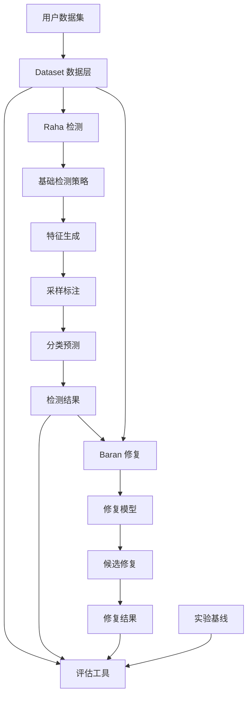
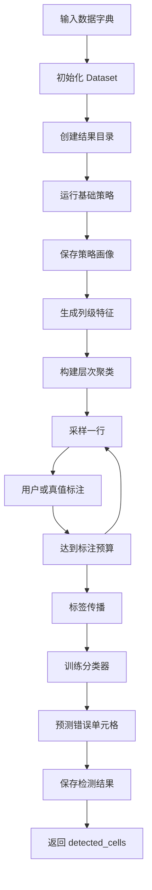
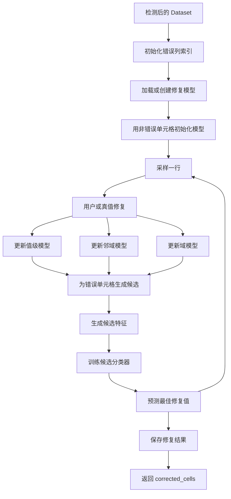
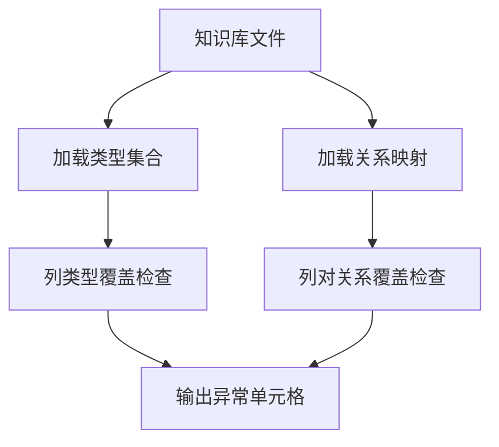
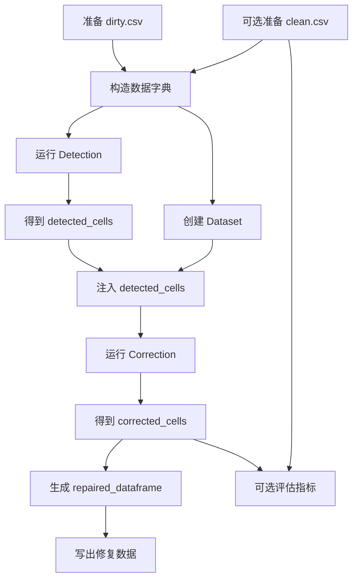
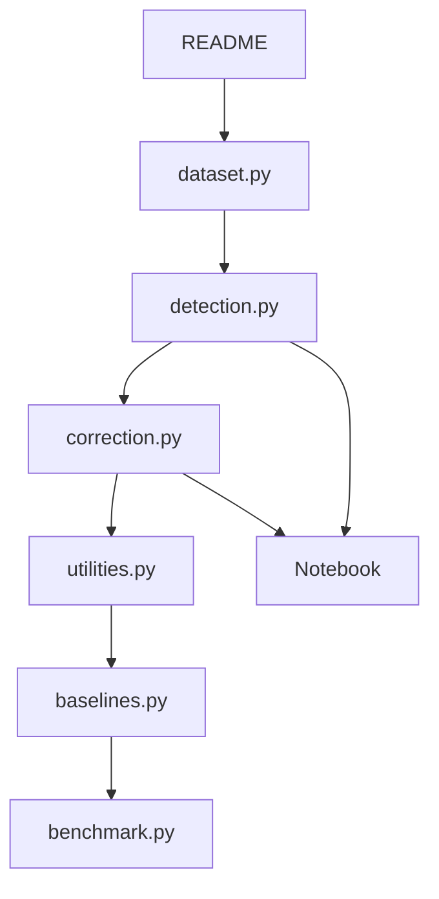

# Raha 项目功能模块设计与快速上手指南

## 1. 项目定位

本项目是 `Raha and Baran` 数据清洗系统的 Python 实现，核心目标是对表格型数据中的错误值进行检测与修复。

- `Raha`：无配置错误检测系统，负责发现可能错误的数据单元格。
- `Baran`：错误修复系统，负责为已检测出的错误单元格生成修复值。
- 共同思想：先用多个基础策略扩大候选集合，再通过少量人工标注或真实清洗数据进行半监督学习，最后输出高精度结果。

项目更偏研究型工程，包含论文复现实验、内置数据集、外部检测工具封装、交互式 Notebook 示例和补充知识库。

## 2. 顶层目录结构

| 路径 | 作用 |
| --- | --- |
| `raha/` | 核心 Python 包，包含检测、修复、评估、基线和工具函数 |
| `raha/tools/` | 外部或内置基础检测器封装，主要是 `dBoost` 和 `KATARA` |
| `datasets/` | 示例数据集，每个数据集通常包含 `dirty.csv` 和 `clean.csv` |
| `documentation/` | 项目论文、Baran 论文和复现实验报告 |
| `supplementaries/` | 补充知识库和预训练修复模型 |
| `pictures/` | README 与 Notebook 展示用界面截图 |
| `setup.py` | Python 包安装配置 |
| `requirements.txt` | 依赖版本约束 |
| `README.md` | 项目简介、安装方式、使用入口和引用信息 |

## 3. 核心模块总览

| 模块 | 文件 | 核心职责 | 主要输出 |
| --- | --- | --- | --- |
| 数据集模块 | `raha/dataset.py` | 读取、标准化、比较、评估表格数据 | `Dataset` 对象、真实错误字典、评估指标 |
| 错误检测模块 | `raha/detection.py` | 执行 Raha 检测流程，集成多种基础检测策略 | `detected_cells` 错误单元格字典 |
| 错误修复模块 | `raha/correction.py` | 执行 Baran 修复流程，生成候选修复并分类选择 | `corrected_cells` 修复字典 |
| 基线模块 | `raha/baselines.py` | 实现论文对比系统或聚合方法 | 各基线检测结果 |
| 工具函数模块 | `raha/utilities.py` | 数据画像、策略筛选、辅助评估 | 策略画像、筛选策略、元评估指标 |
| 实验模块 | `raha/benchmark.py` | 运行论文中的多组实验 | 表格结果和图形结果 |
| 外部工具模块 | `raha/tools/` | 封装基础检测器 | 单策略候选错误结果 |
| Notebook 模块 | `raha/pipeline_*.ipynb` | 交互式演示与人工标注界面 | 可视化清洗流程 |

## 4. 模块关系图



说明：

- `Dataset` 是所有核心流程的基础输入层。
- `Detection` 先调用基础策略生成候选，再学习如何集成候选。
- `Correction` 依赖检测结果，只修复被认为有问题的单元格。
- `Benchmark` 和 `Baselines` 面向论文复现，不是日常最小使用路径。

## 5. 数据集模块设计

文件：`raha/dataset.py`

### 5.1 功能定位

`Dataset` 类统一封装脏数据、干净数据和修复后数据，是项目中所有检测、修复和评估逻辑共享的数据对象。

### 5.2 输入字段

初始化时传入字典：

```python
dataset_dictionary = {
    "name": "toy",
    "path": "datasets/toy/dirty.csv",
    "clean_path": "datasets/toy/clean.csv"
}
```

字段说明：

| 字段 | 是否必需 | 作用 |
| --- | --- | --- |
| `name` | 是 | 数据集名称，也会影响结果目录命名 |
| `path` | 是 | 脏数据 CSV 路径 |
| `clean_path` | 否 | 干净数据 CSV 路径，用于自动标注和评估 |
| `repaired_path` | 否 | 已修复数据 CSV 路径，用于比较修复结果 |

### 5.3 核心方法

| 方法 | 作用 |
| --- | --- |
| `value_normalizer` | 对单元格值做轻量标准化，包含 HTML 反转义、空白合并、首尾空白裁剪 |
| `read_csv_dataset` | 按 UTF-8 读取 CSV，所有值按字符串处理 |
| `write_csv_dataset` | 写出 UTF-8 CSV |
| `get_dataframes_difference` | 比较两个 DataFrame，返回不同单元格及目标值 |
| `create_repaired_dataset` | 根据修复字典生成修复后 DataFrame |
| `get_actual_errors_dictionary` | 比较脏数据和干净数据，得到真实错误 |
| `get_correction_dictionary` | 比较脏数据和修复数据，得到修复变更 |
| `get_data_quality` | 计算数据质量比例 |
| `get_data_cleaning_evaluation` | 输出检测和修复的精确率、召回率、F1 |

### 5.4 数据结构约定

错误和修复结果普遍使用字典表示：

```python
{
    (row_index, column_index): "target_value"
}
```

其中：

- `row_index`：从 0 开始的行号。
- `column_index`：从 0 开始的列号。
- 检测阶段的 value 常是占位值。
- 修复阶段的 value 是预测修复值。

## 6. Raha 错误检测模块设计

文件：`raha/detection.py`

### 6.1 功能定位

`Detection` 类是 Raha 的主入口。它不要求用户提前给出完整规则，而是自动组合多类基础错误检测策略，生成特征，再通过少量标注训练分类器。

### 6.2 关键配置

| 配置 | 默认值 | 说明 |
| --- | --- | --- |
| `LABELING_BUDGET` | `20` | 需要标注的元组数量 |
| `USER_LABELING_ACCURACY` | `1.0` | 模拟用户标注准确率 |
| `SAVE_RESULTS` | `True` | 是否保存中间策略和结果 |
| `CLUSTERING_BASED_SAMPLING` | `True` | 是否使用聚类采样 |
| `STRATEGY_FILTERING` | `False` | 是否基于历史数据筛选策略 |
| `CLASSIFICATION_MODEL` | `GBC` | 单元格错误分类模型 |
| `LABEL_PROPAGATION_METHOD` | `homogeneity` | 标签传播方法 |
| `ERROR_DETECTION_ALGORITHMS` | `OD,PVD,RVD,KBVD` | 启用的基础检测策略 |
| `HISTORICAL_DATASETS` | `[]` | 用于迁移学习式策略筛选的历史数据集 |

### 6.3 基础检测策略

| 策略 | 含义 | 实现来源 | 作用 |
| --- | --- | --- | --- |
| `OD` | Outlier Detection | `dBoost` | 基于统计模型发现离群单元格 |
| `PVD` | Pattern Violation Detection | 内置逻辑 | 通过字符模式发现异常值 |
| `RVD` | Rule Violation Detection | 内置逻辑 | 通过列间函数依赖式冲突发现异常 |
| `KBVD` | Knowledge Base Violation Detection | `KATARA` | 通过知识库类型和关系发现异常 |
| `TFIDF` | 文本特征 | `sklearn` | 可作为额外文本特征使用 |

### 6.4 检测流程



说明：

- 当 `clean_path` 存在时，系统用干净数据自动模拟标注。
- 当 `clean_path` 不存在时，项目预期通过 Notebook 交互界面让用户人工标注。
- 策略输出会保存到 `raha-baran-results-<dataset>/strategy-profiling/`，再次运行时会复用已有策略结果。

### 6.5 核心方法

| 方法 | 作用 |
| --- | --- |
| `initialize_dataset` | 创建 `Dataset` 并初始化结果目录和运行状态 |
| `run_strategies` | 生成并运行基础检测策略 |
| `_strategy_runner_process` | 在并行进程中执行单个策略 |
| `generate_features` | 将策略输出转为单元格特征矩阵 |
| `build_clusters` | 对每列单元格特征做层次聚类 |
| `sample_tuple` | 选择下一行进行标注 |
| `label_with_ground_truth` | 使用干净数据模拟用户标注 |
| `propagate_labels` | 将标注扩展到同质或多数一致的聚类 |
| `predict_labels` | 训练分类器并预测错误单元格 |
| `store_results` | 将检测后的 `Dataset` 对象序列化保存 |
| `run` | Raha 端到端入口 |

## 7. Baran 错误修复模块设计

文件：`raha/correction.py`

### 7.1 功能定位

`Correction` 类是 Baran 的主入口。它以 `Dataset` 对象和 `detected_cells` 为输入，对每个错误单元格生成多个候选修复值，再用已标注样本学习候选选择模型。

### 7.2 关键配置

| 配置 | 默认值 | 说明 |
| --- | --- | --- |
| `PRETRAINED_VALUE_BASED_MODELS_PATH` | 空字符串 | 预训练值修复模型路径 |
| `VALUE_ENCODINGS` | `identity,unicode` | 值编码方式 |
| `CLASSIFICATION_MODEL` | `ABC` | 候选修复分类模型 |
| `USE_PREDICTION_CONFIDENCE` | `True` | 是否使用决策分数挑选候选 |
| `IGNORE_SIGN` | 特殊字符串 | 标识不参与建模的值 |
| `SAVE_RESULTS` | `True` | 是否保存修复结果 |
| `LABELING_BUDGET` | `20` | 修复阶段标注预算 |
| `MIN_CORRECTION_CANDIDATE_PROBABILITY` | `0.0` | 候选修复最小概率 |
| `MIN_CORRECTION_OCCURRENCE` | `2` | 预训练模型剪枝阈值 |
| `MAX_VALUE_LENGTH` | `50` | 值级修复模型处理的最大值长度 |
| `REVISION_WINDOW_SIZE` | `5` | Wikipedia 修订上下文窗口 |
| `NUM_WORKERS` | CPU 数量 | 并行进程数 |
| `CHUNK_SIZE` | `100` | 并行任务分块大小 |

### 7.3 修复模型类型

| 模型 | 数据来源 | 用途 |
| --- | --- | --- |
| 值级模型 | Wikipedia 修订历史或在线标注 | 学习字符删除、插入、替换、整体替换 |
| 邻域模型 | 同一行其他列上下文 | 根据相邻列值预测当前列修复值 |
| 域模型 | 同列已知干净值 | 从列值分布中生成候选修复 |

### 7.4 修复流程



说明：

- `Correction.run` 会在每轮标注后更新模型，并重新预测尚未修复的错误。
- 若 `detected_cells` 为空，修复流程没有可修复目标。
- 示例主函数中直接把真实错误作为 `detected_cells`，这是为了评估 Baran 修复能力，不代表真实生产流程。

### 7.5 核心方法

| 方法 | 作用 |
| --- | --- |
| `extract_revisions` | 从 Wikipedia 修订历史压缩包中提取旧值、新值和上下文 |
| `pretrain_value_based_models` | 训练并保存值级修复模型 |
| `initialize_dataset` | 基于检测结果建立错误列索引和状态容器 |
| `initialize_models` | 加载预训练模型，并用当前数据初始化邻域和域模型 |
| `sample_tuple` | 按剩余错误分布选择下一行标注 |
| `label_with_ground_truth` | 用干净数据模拟修复标注 |
| `update_models` | 用新标注行更新三类修复模型 |
| `generate_features` | 为错误单元格和候选修复生成特征 |
| `predict_corrections` | 按列训练候选分类器并预测修复 |
| `store_results` | 保存修复后的 `Dataset` 对象 |
| `run` | Baran 端到端入口 |

## 8. 基线模块设计

文件：`raha/baselines.py`

### 8.1 功能定位

`Baselines` 类主要用于论文实验对比，提供多个外部系统或聚合策略的近似实现。

### 8.2 内置基线

| 方法 | 对应系统或策略 | 说明 |
| --- | --- | --- |
| `run_dboost` | dBoost | 从策略画像中选择最佳 OD 策略 |
| `run_nadeef` | NADEEF | 使用数据集预置函数依赖和正则约束 |
| `run_katara` | KATARA | 汇总 KBVD 策略输出 |
| `run_activeclean` | ActiveClean | 元组级主动学习检测 |
| `run_min_k` | Min-k | 根据被多少策略命中做阈值聚合 |
| `run_maximum_entropy` | Maximum Entropy | 贪心选择高精度策略 |
| `run_metadata_driven` | Metadata Driven | 组合多类元特征训练检测模型 |

### 8.3 数据集约束

`DATASET_CONSTRAINTS` 保存了部分数据集的函数依赖和正则模式，例如：

- `hospital`：城市、邮编、州、县之间的依赖，以及邮编、州、电话等格式约束。
- `flights`：航班号与计划和实际起降时间之间的依赖。
- `beers`：啤酒厂编号与名称、城市、州之间的依赖。

这些约束用于模拟依赖规则型系统，不是 Raha 主流程必需配置。

## 9. 工具函数模块设计

文件：`raha/utilities.py`

### 9.1 功能定位

该模块提供实验和策略筛选辅助能力，主要用于减少策略执行成本、评估元组级检测效果、基于历史数据迁移策略。

### 9.2 核心函数

| 函数 | 作用 |
| --- | --- |
| `get_tuple_wise_evaluation` | 将单元格检测结果转为元组级精确率、召回率、F1 |
| `dataset_profiler` | 为每列统计字符分布和值分布 |
| `evaluation_profiler` | 评估每个策略在每列上的表现 |
| `get_selected_strategies_via_historical_data` | 根据历史列相似度和历史 F1 筛选策略 |
| `get_selected_strategies_via_ground_truth` | 基于真实标签选出最差、随机、最好策略集合 |
| `get_strategies_count_and_runtime` | 统计策略数量和总耗时 |
| `error_detection_with_selected_strategies` | 使用已筛选策略运行 Raha 后半段流程 |

## 10. 实验模块设计

文件：`raha/benchmark.py`

### 10.1 功能定位

`Benchmark` 类用于复现论文实验。默认实验重复次数为 `RUN_COUNT = 10`，默认数据集为 `hospital`、`flights`、`beers`、`rayyan`、`movies_1`。

### 10.2 实验列表

| 实验 | 方法 | 主题 |
| --- | --- | --- |
| 实验 1 | `experiment_1` | 与 dBoost、NADEEF、KATARA、ActiveClean 等基线对比 |
| 实验 2 | `experiment_2` | 特征组影响分析 |
| 实验 3 | `experiment_3` | 采样方式影响分析 |
| 实验 4 | `experiment_4` | 历史数据策略筛选影响分析 |
| 实验 5 | `experiment_5` | 用户标注错误影响分析 |
| 实验 6 | `experiment_6` | 系统可扩展性分析 |
| 实验 7 | `experiment_7` | Baran 修复特征影响分析 |

注意：

- 实验流程可能耗时较长，且会创建或复用 `raha-baran-results-*` 中间结果目录。
- 部分实验依赖较大的数据集和已生成策略画像。
- 作为快速上手，不建议第一步运行完整 `Benchmark`。

## 11. 外部工具模块设计

### 11.1 dBoost

路径：`raha/tools/dBoost/`

dBoost 用于统计离群检测，对应 Raha 策略 `OD`。`Detection._strategy_runner_process` 会将当前数据集临时写成 CSV，再调用 `raha.tools.dBoost.dboost.imported_dboost.run(params)`，最后读取 dBoost 输出文件并转为单元格坐标。

### 11.2 KATARA

路径：`raha/tools/KATARA/`

KATARA 用于知识库驱动的类型和关系校验，对应 Raha 策略 `KBVD`。其核心流程是：



知识库文件通常为制表符分隔的三元组：主体、关系、客体。

## 12. 数据和结果目录约定

### 12.1 输入数据

示例数据集位于 `datasets/<dataset_name>/`：

| 文件 | 说明 |
| --- | --- |
| `dirty.csv` | 待检测或待修复的脏数据 |
| `clean.csv` | 干净数据，用于自动标注和评估 |

当前项目包含：

- `beers`
- `flights`
- `hospital`
- `movies_1`
- `rayyan`
- `tax`
- `toy`

### 12.2 输出结果

默认结果目录位于对应数据集目录下：

```text
datasets/<dataset_name>/raha-baran-results-<dataset_name>/
```

常见子目录：

| 子目录 | 说明 |
| --- | --- |
| `strategy-profiling/` | 基础检测策略输出和耗时 |
| `dataset-profiling/` | 数据列画像 |
| `evaluation-profiling/` | 策略在历史数据上的评估画像 |
| `error-detection/` | Raha 检测后的序列化结果 |
| `error-correction/` | Baran 修复后的序列化结果 |

## 13. 端到端数据清洗流程



## 14. 快速上手

### 14.1 创建环境

建议使用 Python 虚拟环境：

```powershell
cd F:\ai-code\raha\raha-master
python -m venv .venv
.\.venv\Scripts\Activate.ps1
python -m pip install --upgrade pip
pip install -r requirements.txt
```

如果只想安装包本身：

```powershell
pip install -e .
```

### 14.2 最小检测示例

新建临时脚本或在 Python 交互环境中运行：

```python
import os
import raha

dataset_name = "toy"
dataset_dictionary = {
    "name": dataset_name,
    "path": os.path.abspath(os.path.join("datasets", dataset_name, "dirty.csv")),
    "clean_path": os.path.abspath(os.path.join("datasets", dataset_name, "clean.csv")),
}

detector = raha.Detection()
detector.VERBOSE = True
detector.LABELING_BUDGET = 5
detection_dictionary = detector.run(dataset_dictionary)

data = raha.Dataset(dataset_dictionary)
precision, recall, f1 = data.get_data_cleaning_evaluation(detection_dictionary)[:3]
print(precision, recall, f1)
```

说明：

- `LABELING_BUDGET` 越大，一般标注信息越多，但运行时间也越长。
- 首次运行会生成策略画像，后续运行可能复用已有画像。
- 顶层 `import raha` 会加载较多子模块，启动慢时可等待，或在调试时直接运行项目自带脚本。

### 14.3 最小修复示例

真实流程中应先运行 `Detection`。如果只是验证 Baran 修复能力，也可以像源码示例一样用真实错误模拟检测结果：

```python
import os
import raha

dataset_name = "toy"
dataset_dictionary = {
    "name": dataset_name,
    "path": os.path.abspath(os.path.join("datasets", dataset_name, "dirty.csv")),
    "clean_path": os.path.abspath(os.path.join("datasets", dataset_name, "clean.csv")),
}

data = raha.Dataset(dataset_dictionary)
data.detected_cells = dict(data.get_actual_errors_dictionary())

corrector = raha.Correction()
corrector.VERBOSE = True
corrector.LABELING_BUDGET = 5
correction_dictionary = corrector.run(data)

data.create_repaired_dataset(correction_dictionary)
data.write_csv_dataset(os.path.abspath("datasets/toy/repaired.csv"), data.repaired_dataframe)

precision, recall, f1 = data.get_data_cleaning_evaluation(correction_dictionary)[-3:]
print(precision, recall, f1)
```

### 14.4 检测加修复端到端示例

```python
import os
import raha

dataset_name = "toy"
dataset_dictionary = {
    "name": dataset_name,
    "path": os.path.abspath(os.path.join("datasets", dataset_name, "dirty.csv")),
    "clean_path": os.path.abspath(os.path.join("datasets", dataset_name, "clean.csv")),
}

detector = raha.Detection()
detector.LABELING_BUDGET = 5
detected_cells = detector.run(dataset_dictionary)

data = raha.Dataset(dataset_dictionary)
data.detected_cells = detected_cells

corrector = raha.Correction()
corrector.LABELING_BUDGET = 5
corrected_cells = corrector.run(data)

data.create_repaired_dataset(corrected_cells)
output_path = os.path.abspath(os.path.join("datasets", dataset_name, "repaired.csv"))
data.write_csv_dataset(output_path, data.repaired_dataframe)

print(output_path)
print(data.get_data_cleaning_evaluation(corrected_cells))
```

### 14.5 运行内置模块示例

检测模块：

```powershell
python raha\detection.py
```

修复模块：

```powershell
python raha\correction.py
```

注意：

- 源码示例默认使用 `flights` 数据集，运行时间可能比 `toy` 更长。
- 如果只是验证流程，建议先把示例脚本中的 `dataset_name` 改成 `toy`。

### 14.6 使用 Notebook

项目在 `raha/` 目录下提供了三个 Notebook：

| Notebook | 作用 |
| --- | --- |
| `pipeline_1_(minimal_and_sequential).ipynb` | 最小顺序流程 |
| `pipeline_2_(minimal_and_integrated).ipynb` | 最小集成流程 |
| `pipeline_3_(detailed_demo).ipynb` | 更完整的交互式演示 |

启动方式：

```powershell
jupyter notebook
```

如果没有安装 Jupyter：

```powershell
pip install notebook
```

## 15. 新数据集接入方式

### 15.1 准备目录

```text
datasets/my_dataset/
  dirty.csv
  clean.csv
```

### 15.2 构造数据字典

```python
dataset_dictionary = {
    "name": "my_dataset",
    "path": "datasets/my_dataset/dirty.csv",
    "clean_path": "datasets/my_dataset/clean.csv",
}
```

### 15.3 没有干净数据时

如果没有 `clean.csv`：

- 可以只传 `name` 和 `path`。
- `Detection.run` 无法自动执行 `label_with_ground_truth`。
- 需要通过 Notebook 或自定义交互逻辑给 `d.labeled_cells` 写入标注。

## 16. 常见风险与注意事项

### 16.1 顶层导入偏重

`raha/__init__.py` 会一次性导出 `dataset`、`detection`、`correction`、`baselines`、`utilities`、`benchmark`、`KATARA`、`dBoost` 等内容，因此 `import raha` 可能较慢。

### 16.2 中间结果会影响重复运行

如果 `strategy-profiling/` 已存在，`Detection.run_strategies` 会直接加载旧策略结果。调试策略变更时，应注意是否需要清理旧结果目录。

### 16.3 多进程与 Windows 环境

`Detection` 和 `Correction` 都使用多进程。Windows 下运行自定义脚本时，建议把执行逻辑放到：

```python
if __name__ == "__main__":
    main()
```

否则可能遇到多进程重复启动问题。

### 16.4 依赖版本较旧

项目使用的部分 API 可能和新版依赖存在兼容问题，例如旧版 Pandas 中的 `iteritems`。优先使用 `requirements.txt` 中的版本。

### 16.5 结果解释

`get_data_cleaning_evaluation` 返回六个指标：

```text
[检测精确率, 检测召回率, 检测 F1, 修复精确率, 修复召回率, 修复 F1]
```

只做错误检测时通常取前三个；做错误修复时通常关注后三个。

## 17. 推荐阅读顺序



建议先理解 `Dataset` 的数据结构，再看 `Detection.run` 和 `Correction.run`。`Baselines` 和 `Benchmark` 放在后面阅读，因为它们主要服务实验复现。

## 18. 二次开发建议

### 18.1 增加新的检测策略

扩展点在 `Detection.run_strategies` 和 `_strategy_runner_process`：

1. 在 `ERROR_DETECTION_ALGORITHMS` 中加入新策略名称。
2. 在 `run_strategies` 中生成该策略的配置列表。
3. 在 `_strategy_runner_process` 中实现执行逻辑。
4. 返回统一格式的 `strategy_profile`。

统一格式如下：

```python
strategy_profile = {
    "name": strategy_name,
    "output": detected_cells_list,
    "runtime": runtime_seconds,
}
```

### 18.2 增加新的修复候选模型

扩展点在 `Correction.generate_features`：

1. 增加候选生成函数。
2. 将候选及概率加入 `models_corrections`。
3. 保证每个候选值最终能形成固定长度特征向量。
4. 复用 `predict_corrections` 的候选分类流程。

### 18.3 增加新的实验

扩展点在 `Benchmark`：

1. 新增 `experiment_x` 方法。
2. 构造数据集字典。
3. 调用 `Detection`、`Correction`、`Baselines` 或 `Utilities`。
4. 使用 `prettytable` 输出表格，必要时用 `matplotlib` 画图。

## 19. 最短使用路径总结

如果只想快速体验项目：

1. 安装依赖。
2. 选择 `datasets/toy/`。
3. 用 `Detection.run` 得到 `detected_cells`。
4. 把 `detected_cells` 写入 `Dataset` 对象。
5. 用 `Correction.run` 得到 `corrected_cells`。
6. 用 `create_repaired_dataset` 和 `write_csv_dataset` 写出结果。
7. 用 `get_data_cleaning_evaluation` 查看效果。

如果只想读懂项目：

1. 看 `README.md`。
2. 看 `raha/dataset.py`。
3. 看 `raha/detection.py` 的 `run` 方法。
4. 看 `raha/correction.py` 的 `run` 方法。
5. 再看 `utilities`、`baselines` 和 `benchmark`。
